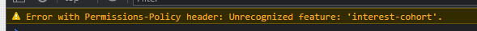
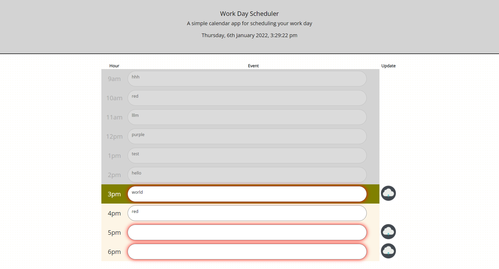

## Scheduler - Steve Barry

##  The Task

The task was to create a simple calendar application that allows a user to save events for each hour of the day. This app will run in the browser and feature dynamically updated HTML and CSS powered by jQuery, specifically the [Moment.js](https://momentjs.com/) library.

### ⭐ ⭐ S.T.A.R. ⭐ ⭐

**SITUATION**

The provided user story was: 

> AS AN employee with a busy schedule
> 
> I WANT to add important events to a daily planner
>
> SO THAT I can manage my time effectively

**TASK**

Provide a solution that allows a user to note events against a specific hour block, and that data persists on page exit/load. the page should also highlist past, present, and future time blocks, as well as displaying the current date/time.

**ACTION**

Writing of a solution to resolve the situation, including:
* Layout
  * *Layout is responsive and functional on various screen sizes*
  * *Simple, yet attractive design*
  * *Logical layout*
  * *Improved code visualisation - eg: indentation*
  * *Error free loading*
  * *Favicon designed and added*
  * *Thorough comments*
  * *Intuitive design with feedback for users*
* Javascript
  * *Error free performance*
  * *Multiple functions to separate aspects of code*
  * *Thorough comments*
* GIT
  * *Numerous commits to track changes in code*
  * *Code added to public repository and Github Pages for public viewing*
* Functionality
  * *Feedback to the user to show if any unsaved changes*
  * *Past events disabled to prevent historical data being changed without intentionally checking a box to do so*
  * *Visual feedback to the user to show saving*
  * *The timeblocks update past/present/future without user input*

**RESULT**

The end code is stored on Github, and publicly available and viewable. This result meets all requirements of the User Story and acceptance criteria:

* ~~GIVEN I am using a daily planner to create a schedule~~
* ~~WHEN I open the planner~~
* ~~THEN the current day is displayed at the top of the calendar~~
* ~~WHEN I scroll down~~
* ~~THEN I am presented with timeblocks for standard business hours~~
* ~~WHEN I view the timeblocks for that day~~
* ~~THEN each timeblock is color coded to indicate whether it is in the past, present, or future~~
* ~~WHEN I click into a timeblock~~
* ~~THEN I can enter an event~~
* ~~WHEN I click the save button for that timeblock~~
* ~~THEN the text for that event is saved in local storage~~
* ~~WHEN I refresh the page~~
* ~~THEN the saved events persist~~

##  The Outcome

> There is a new Google feature named FLoc that is generating the below error. This is not a result of the performance or design of the site.
> 
> 
> 
> [Google FLoC](https://techcrunch.com/2021/03/30/google-starts-trialling-its-floc-cookie-alternative-in-chrome/)

You can view the finished product [HERE](https://nbs5000.github.io/scheduler/)

Alternatively, here is a screenshot:

> 

---

Written by Steve Barry - Due date 10/1/2022

© 2021 Trilogy Education Services, LLC, a 2U, Inc. brand. Confidential and Proprietary. All Rights Reserved.

